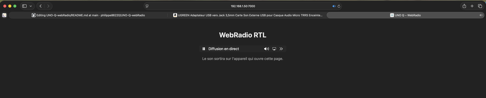
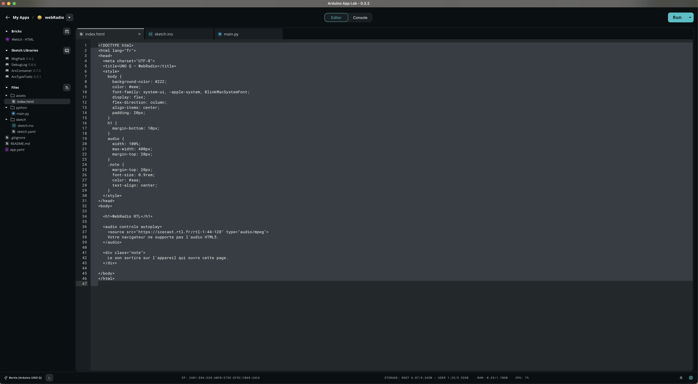

# Arduino UNO Q – Lecture d'une Web Radio depuis le navigateur internet

# 🧩 Fonctionnement 100 % dans Arduino App Lab
Ce projet fonctionne entièrement à l’intérieur d’Arduino App Lab, sans logiciel externe ni serveur  
supplémentaire.
- Le brick `WebUI – HTML` affiche l’interface de lecture de la radio RTL dans le navigateur.
- Le fichier Python (`main.py`) démarre le serveur Web UI et rend la page `index.html` disponible via l'IP de la carte.
- SI l'IP est utilisée dans le navigateur de l'ordinateur c'est le son de sa carte son qui sera entendu.
- SI l'IP est utilisée dans le navigateur de la UNO Q grâce à un HUB USB et HDMI mais également avec un adaptateur carte son USB avec jack 3.5
  alors le son sortira directement du jack à l'aide d'un écouteur ou d'un Haut-parleur disposant d'une entrée 3.5.

Grâce à cette interface Web locale, vous pouvez écouter la radio RTL.

---

## 🎯 Objectifs du projet

- Créer une interface Web permettant de lire le flux audio RTL à cette adresse : `https://icecast.rtl.fr/rtl-1-44-128`.

Ce projet constitue une démonstration de lecture d'une Web Radio à aprtir de la UNO Q.
Il peut servir de point de départ à une application plus complexe.


---

## 🔧 Matériel utilisé

- Arduino **UNO Q**
- HUB USB de ce type : https://www.amazon.fr/dp/B0CF224WX9?ref=ppx_yo2ov_dt_b_fed_asin_title&th=1
- Adaptateur USB vers Jack 3,5mm Carte Son Externe USB pour Casque Audio Micro TRRS Enceinte Haut Parleur : 
 https://www.amazon.fr/dp/B08Y8CZB2S?ref=ppx_yo2ov_dt_b_fed_asin_title
- **Navigateur de l'ordinateur ou de la UNO-Q**


---

## 🚀 1. Code index.html 

```html
<!DOCTYPE html>
<html lang="fr">
<head>
  <meta charset="UTF-8">
  <title>UNO Q – WebRadio</title>
  <style>
    body {
      background-color: #222;
      color: #eee;
      font-family: system-ui, -apple-system, BlinkMacSystemFont;
      display: flex;
      flex-direction: column;
      align-items: center;
      padding: 20px;
    }
    h1 {
      margin-bottom: 10px;
    }
    audio {
      width: 100%;
      max-width: 400px;
      margin-top: 20px;
    }
    .note {
      margin-top: 20px;
      font-size: 0.9rem;
      color: #aaa;
      text-align: center;
    }
  </style>
</head>
<body>

  <h1>WebRadio RTL</h1>

  <audio controls autoplay>
    <source src="https://icecast.rtl.fr/rtl-1-44-128" type="audio/mpeg">
    Votre navigateur ne supporte pas l'audio HTML5.
  </audio>

  <div class="note">
    Le son sortira sur l'appareil qui ouvre cette page.
  </div>

</body>
</html>

```
---

## 🐍 Code Python (Linux / App Lab)  
⚠️ Important : remplacez l’URL IFTTT par la vôtre.

```python

from arduino.app_utils import App
from arduino.app_bricks.web_ui import WebUI

# Initialisation du serveur WebUI
ui = WebUI()

print("WebUI started", flush=True)

# Lancement de l'application App Lab
App.run()


```

---

## 3. Code STM32 (C++ - sketch.ino) 
le code est vide car il l'y a pas en l'état de lien établit avec le coeur STM32. 

```C++

void setup() {
  // put your setup code here, to run once:

}

void loop() {
  // put your main code here, to run repeatedly:

}

```

---


## Aperçu : 



---

##  🙏 Remerciements
Ce projet a été développé avec l’aide de ChatGPT.   


